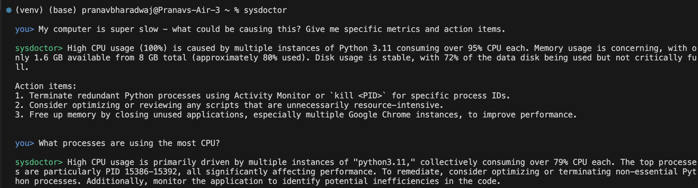

# sysdoctor
A command line AI assistant that figures out why your computer is being weird

## How it works

sysdoctor provides LLMs real-time system data from your machine:

- Continuously collects system metrics (CPU, memory, disk, processes) in the background
- Maintains a (small) history of system snapshots to track performance trends
- Automatically includes current system state as context for every user question

The goal is to get specific action items based on your machine's state rather than generic advice.

## Example


## Setup

1. Install dependencies: `pip install -r requirements.txt`
2. Create a `.env` file in the `sysdoctor` directory:
   ```
   OPENAI_API_KEY=your_api_key_here
   ```

## Usage
### Run as a CLI command (recommended)
```bash
sysdoctor [--log-level LEVEL]
```

### Run as a Python script
```bash
python sysdoctor.py [--log-level LEVEL]
```

#### One-time setup for CLI usage
1. Make the script executable:
   ```bash
   chmod +x sysdoctor.py
   ```
2. Create a symlink to `/usr/local/bin`:
   ```bash
   ln -sf "$PWD/sysdoctor.py" /usr/local/bin/sysdoctor
   ```
3. Now you can run `sysdoctor` from anywhere in your terminal.

**Arguments:**
- `--log-level`: Set logging level (default: INFO)

Type `exit` or `quit` to exit.
